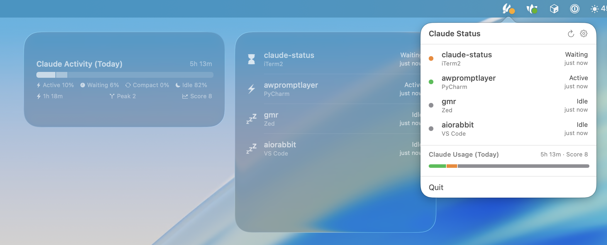

# Claude Status

A native macOS menu bar app that monitors all your [Claude Code](https://docs.anthropic.com/en/docs/claude-code) sessions in one place. See what every session is doing at a glance and jump to any one with a click.




[⬇️ Download Latest Version](https://github.com/gmr/claude-status/releases/download/1.1.5/Claude-Status-1.1.5.pkg)

## Features

- **Real-time status indicator** — A small indicator in your menu bar shows the aggregate state across all sessions: active, waiting for input, compacting context, or idle. Choose between emoji indicators or minimal colored dots.
- **One-click session focusing** — Click a session in the dropdown or a desktop widget to focus its exact window, tab, or pane. Works with VS Code, Zed, Xcode, JetBrains IDEs (IntelliJ IDEA, PyCharm, WebStorm, GoLand, CLion, RubyMine, Rider, PhpStorm, DataGrip, DataSpell), iTerm2 (with tab and window-specific AppleScript focusing), Terminal, Warp, Alacritty, Kitty, WezTerm, Ghostty, and tmux (automatic window and pane selection with any supported terminal).
- **Usage analytics** — Tracks time spent in each session state and session concurrency throughout the day. See your daily usage summary and concurrency counts in the menu bar dropdown and desktop widgets.
- **Session naming** — Use the `/name-session` slash command to label sessions with meaningful names like "API Refactor" or "Bug Fix #421". Names show up in the menu bar and widgets so you always know which session is which.
- **Desktop widgets** — Multiple native WidgetKit widgets show session status, usage analytics, and concurrency at a glance on your desktop.
- **Launch at login** — Runs quietly in the menu bar with no dock icon. Configure everything from a simple settings window.

## Session States

| State | Emoji | Dot | Meaning |
| --- | --- | --- | --- |
| Active | ⚡ | 🟢 | Claude is working |
| Waiting | ⏳ | 🟠 | Needs your input |
| Compacting | 🧹 | 🔵 | Context compaction in progress |
| Idle | 💤 | ⚪ | No recent activity |

## Install

Download the latest release from the [Releases](https://github.com/gmr/claude-status/releases) page. Move `Claude Status.app` to `/Applications` and launch it.

On first launch, the app will prompt to install the Claude Code plugin hook. You can also install or uninstall it later from Settings.

### Build from Source
```bash
git clone https://github.com/gmr/claude-status.git
cd claude-status
xcodebuild -project "Claude Status.xcodeproj" \
  -scheme "Claude Status" \
  -configuration Release build
```

The built app will be in `build/Release/Claude Status.app`.

### Requirements

- macOS 26.2 or later
- Claude Code CLI installed
- Xcode 26 or later (only if building from source)

## Usage

- **Left-click** — Open the session list
- **Right-click** — Quick context menu
- **Click a session** — Focus it in its host app
- **Hover a session** — See its full working directory

## How It Works

Claude Status bundles a Claude Code plugin that hooks into session lifecycle events. When Claude Code starts, stops, or changes state, the plugin writes a `.cstatus` file and posts a Darwin notification. The menu bar app picks up changes instantly through three complementary mechanisms: Darwin notifications for real-time push, file system watching as backup, and a 5-second polling timer as a fallback.

Sessions are validated by checking that the process is still alive and classified by walking the process tree to determine whether they're running in a terminal, IDE, or tmux.

## License

[BSD 3-Clause License](LICENSE)
